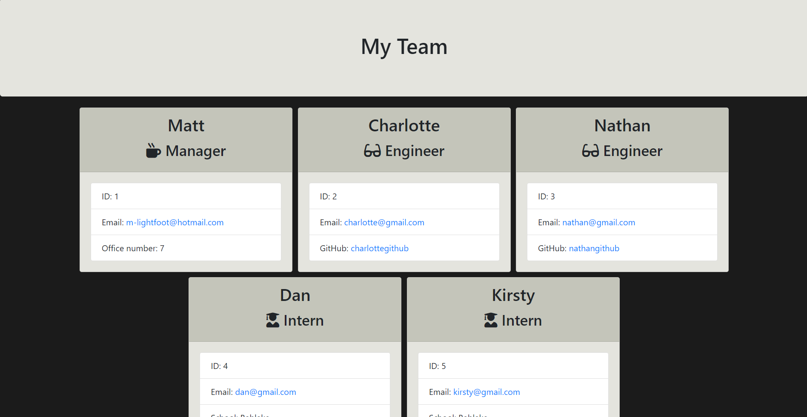

# Team Profile Generator

## Description
This project is an app that can be used to generate a HTML file from asking the user questions in the terminal where the answers will fill out the information to the HTML file. The HTML file that it will generate is a team profile and the questions will be details about members of the team you want to generate.

## Table of Contents

* [Installation](#installation)
* [Usage](#usage)
* [License](#license)
* [Contributing](#contributing)
* [Tests](#tests)
* [Questions](#questions)

## Installation
To install necessary dependencies, run the following commands:
* npm i
* npm install jest (jest must also be added to your package.json file in the "test": section )
* npm install inquirer@6.3.1

## Usage
To use the repo the user must first install dependencies by typing in npm i into the terminal and pressing enter. Then you will need to install jest and inquirer, to do this type in npm install jest in the terminal, and then also npm install inquirer@6.3.1. Then you must remember to add jest to your test section in the package.json file. Once this is done the user can type in node index.js into the terminal and press enter, then they will be asked various questions which can be filled in and submitted by pressing enter. Once this is done the user can select to add more members or to finish the document. Once finish document has been selected the HTML file will be generated using your answers.

## Screenshot

## License
Ths project is licensed under the MIT license.

## Contributing
To contribute to the repo please get in contact with the repo owner, the details are below

## Tests
To run tests, run the following command:
* npm run test

## Questions
If you have any questions about the repo, open an issue or contact me directly at M-lightfoot@hotmail.com. You can find more of my work at [Mtlightfoot](https://github.com/Mtlightfoot).